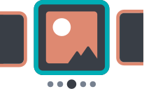
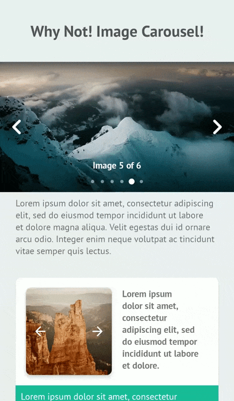
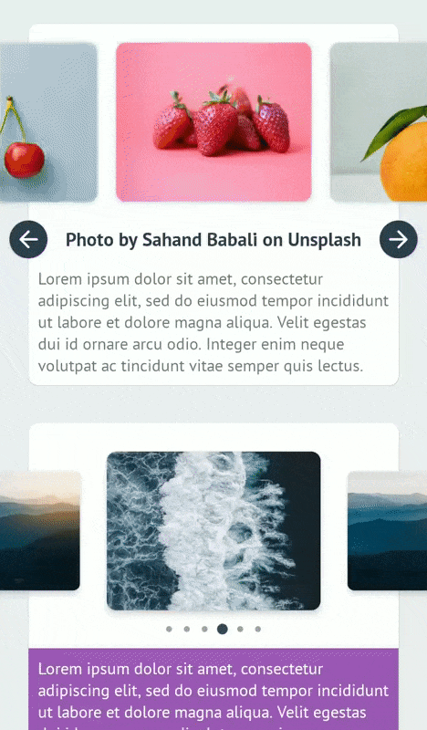
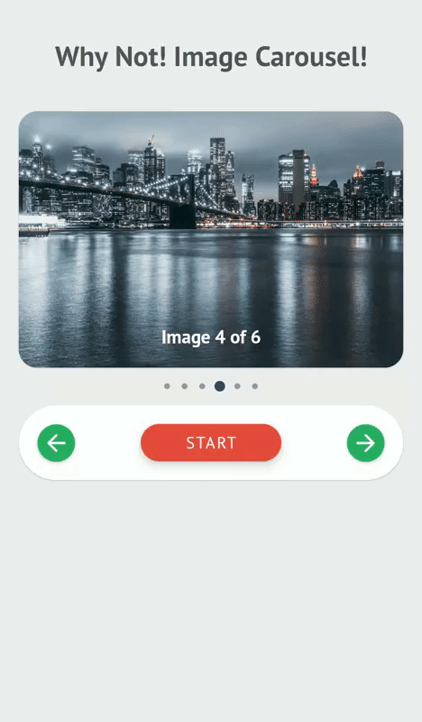
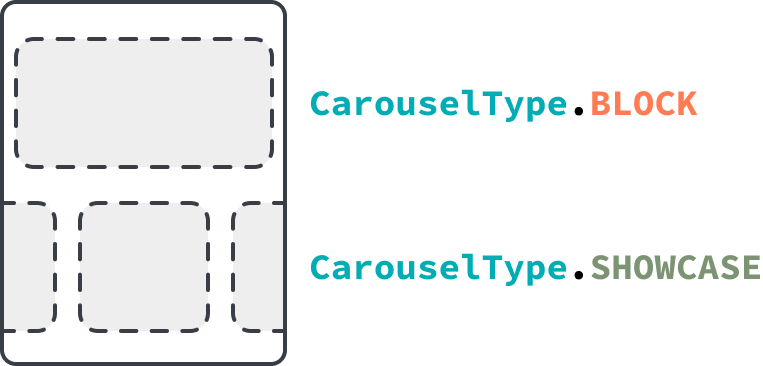
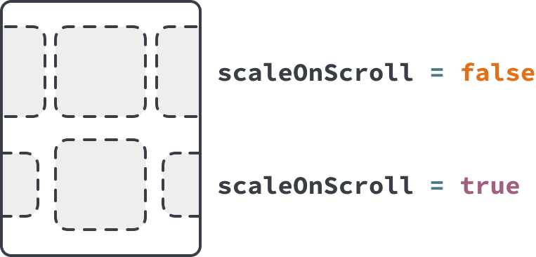
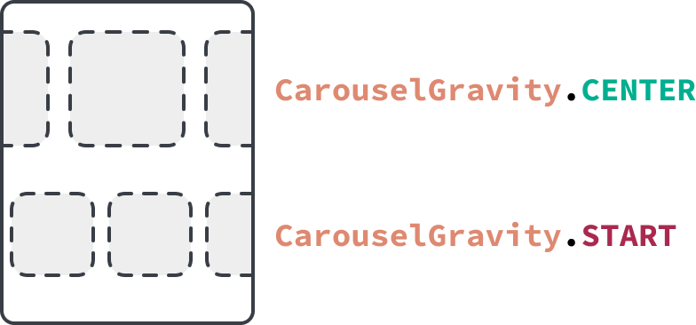

# Why Not! Image Carousel!

An easy, super simple and customizable image carousel view for Android.

[](https://github.com/ImaginativeShohag)
[](https://github.com/ImaginativeShohag/Oops-No-Internet/releases)
[]( https://android-arsenal.com/details/1/8053)
[](https://android-arsenal.com/api?level=21)

## Preview

|  |     |
| :---------------------------------: | :---------------------------------: |
|  |  |

## Usage

### Dependency

#### Add the followings to your project level `build.gradle` file.

```groovy
dependencies {
    // Material Components for Android. Replace the version with the latest version of Material Components library.
    implementation 'com.google.android.material:material:1.3.0'
    
    // Optional: Circle Indicator (To fix the xml preview "Missing classes" error)
    implementation 'me.relex:circleindicator:2.1.6'

    implementation 'org.imaginativeworld.whynotimagecarousel:whynotimagecarousel:2.0.0'
}
```

### Requirements

**0.** Minimum SDK for this library is **API 21** (Android 5.0 Lollipop).

**1.** Your application have to use **AndroidX** to use this library.

**2.** Your have to use **\*.MaterialComponents.\*** in you styles.

### Finally

Add the view `org.imaginativeworld.whynotimagecarousel.ImageCarousel` in your layout:

```xml
<org.imaginativeworld.whynotimagecarousel.ImageCarousel
    android:id="@+id/carousel"
    android:layout_width="match_parent"
    android:layout_height="256dp" />
```

Use the `CarouselItem` class for data item. Initialize the `ImageCarousel` with data using `setData()` function:

```kotlin
// Kotlin
val carousel: ImageCarousel = findViewById(R.id.carousel)

// Register lifecycle. For activity this will be lifecycle/getLifecycle() and for fragment it will be viewLifecycleOwner/getViewLifecycleOwner().
carousel.registerLifecycle(lifecycle)

val list = mutableListOf<CarouselItem>()

// Image URL with caption
list.add(
    CarouselItem(
        imageUrl = "https://images.unsplash.com/photo-1532581291347-9c39cf10a73c?w=1080",
        caption = "Photo by Aaron Wu on Unsplash"
    )
)

// Just image URL
list.add(
    CarouselItem(
        imageUrl = "https://images.unsplash.com/photo-1534447677768-be436bb09401?w=1080"
    )
)

// Image URL with header
val headers = mutableMapOf<String, String>()
headers["header_key"] = "header_value"

list.add(
    CarouselItem(
        imageUrl = "https://images.unsplash.com/photo-1534447677768-be436bb09401?w=1080",
        headers = headers
    )
)

// Image drawable with caption
list.add(
    CarouselItem(
        imageDrawable = R.drawable.image_1,
        caption = "Photo by Kimiya Oveisi on Unsplash"
    )
)

// Just image drawable
list.add(
    CarouselItem(
        imageDrawable = R.drawable.image_2
    )
)

// ...

carousel.setData(list)
```

```java
// Java
ImageCarousel carousel = findViewById(R.id.carousel);

// Register lifecycle. For activity this will be lifecycle/getLifecycle() and for fragments it will be viewLifecycleOwner/getViewLifecycleOwner().
carousel.registerLifecycle(getLifecycle());

List<CarouselItem> list = new ArrayList<>();

// Image URL with caption
list.add(
    new CarouselItem(
        "https://images.unsplash.com/photo-1532581291347-9c39cf10a73c?w=1080",
        "Photo by Aaron Wu on Unsplash"
    )
);

// Just image URL
list.add(
    new CarouselItem(
        "https://images.unsplash.com/photo-1534447677768-be436bb09401?w=1080"
    )
);

// Image URL with header
Map<String, String> headers = new HashMap<>();
headers.put("header_key", "header_value");

list.add(
    new CarouselItem(
        "https://images.unsplash.com/photo-1534447677768-be436bb09401?w=1080",
        headers
    )
);

// Image drawable with caption
list.add(
    new CarouselItem(
        R.drawable.image_1,
        "Photo by Kimiya Oveisi on Unsplash"
    )
);

// Just image drawable
list.add(
    new CarouselItem(
        R.drawable.image_2
    )
);

// ...

carousel.setData(list);
```

That's all you need to use the library! :)

Detail examples can be found [here](/sample).

## `ImageCarousel` XML attributes

All the custom XML attributes for `ImageCarousel` view with default values are given below. All attributes are optional.

```xml
<org.imaginativeworld.whynotimagecarousel.ImageCarousel
    android:id="@+id/carousel"
    android:layout_width="match_parent"
    android:layout_height="match_parent"
    
    app:showTopShadow="true"
    app:topShadowAlpha="0.6"
    app:topShadowHeight="32dp"
    
    app:showBottomShadow="true"
    app:bottomShadowAlpha="0.6"
    app:bottomShadowHeight="64dp"
    
    app:showCaption="true"
    app:captionMargin="0dp"
    app:captionTextSize="14sp"

    app:showIndicator="true"
    app:indicatorMargin="0dp"
    
    app:imageScaleType="centerCrop"
    
    app:carouselBackground="#00000000"
    app:imagePlaceholder="@drawable/ic_picture"

    app:carouselPadding="0dp"
    app:carouselPaddingBottom="0dp"
    app:carouselPaddingEnd="0dp"
    app:carouselPaddingStart="0dp"
    app:carouselPaddingTop="0dp"

    app:showNavigationButtons="true"
    app:previousButtonLayout="@layout/previous_button_layout"
    app:previousButtonId="@id/btn_previous"
    app:previousButtonMargin="4dp"
    app:nextButtonLayout="@layout/next_button_layout"
    app:nextButtonId="@id/btn_next"
    app:nextButtonMargin="4dp"
    
    app:carouselType="BLOCK"
    app:carouselGravity="CENTER"
    
    app:scaleOnScroll="false"
    app:scalingFactor="0.15"
    app:autoWidthFixing="true"
    app:autoPlay="false"
    app:autoPlayDelay="3000"
    app:infiniteCarousel="true"
    app:touchToPause="true" />
```

## `ImageCarousel` methods

You can also set all the attributes programmatically. All the methods and their usages given below.

### Kotlin

```kotlin
val carousel: ImageCarousel = findViewById(R.id.carousel)

// Attributes
carousel.carouselPadding = 0.dpToPx(context)
carousel.carouselPaddingStart = 0.dpToPx(context)
carousel.carouselPaddingTop = 0.dpToPx(context)
carousel.carouselPaddingEnd = 0.dpToPx(context)
carousel.carouselPaddingBottom = 0.dpToPx(context)

carousel.showTopShadow = true
carousel.topShadowAlpha = 0.6f // 0 to 1, 1 means 100%
carousel.topShadowHeight = 32.dpToPx(context) // px value of dp

carousel.showBottomShadow = true
carousel.bottomShadowAlpha = 0.6f // 0 to 1, 1 means 100%
carousel.bottomShadowHeight = 64.dpToPx(context) // px value of dp

carousel.showCaption = true
carousel.captionMargin = 0.dpToPx(context) // px value of dp
carousel.captionTextSize = 14.spToPx(context) // px value of sp

carousel.showIndicator = true
carousel.indicatorMargin = 0.dpToPx(context) // px value of dp

carousel.showNavigationButtons = true
carousel.imageScaleType = ImageView.ScaleType.CENTER_CROP
carousel.carouselBackground = ColorDrawable(Color.parseColor("#333333"))
carousel.imagePlaceholder = ContextCompat.getDrawable(
    context,
    R.drawable.ic_picture
)

// For custom previous or next button layout,
// set the layout using "previousButtonLayout" attribute and
// give the View/Button id in "previousButtonId" attribute.
carousel.previousButtonLayout = R.layout.previous_button_layout
carousel.previousButtonId = R.id.btn_previous
carousel.previousButtonMargin = 4.dpToPx(context) // px value of dp

carousel.nextButtonLayout = R.layout.next_button_layout
carousel.nextButtonId = R.id.btn_next
carousel.nextButtonMargin = 4.dpToPx(context) // px value of dp

carousel.carouselType = CarouselType.BLOCK
carousel.scaleOnScroll = false
carousel.scalingFactor = .15f // 0 to 1; 1 means 100

// If the width of a single item in ImageCarousel is not greater then
// half of the whole ImageCarousel view width, then the ImageCarousel
// will not work as expected, So it is recommended to set this value
// true all the time. So, the carousel will automatically increase the
// width of the items if necessary.
carousel.autoWidthFixing = true

// If you want auto slide, turn this feature on.
carousel.autoPlay = false
carousel.autoPlayDelay = 3000 // Milliseconds

// Touch to pause autoPlay.
carousel.touchToPause = true

// Infinite scroll for the carousel.
carousel.infiniteCarousel = true

// Scroll listener
carousel.onScrollListener = object : CarouselOnScrollListener {
    override fun onScrollStateChanged(
        recyclerView: RecyclerView,
        newState: Int,
        position: Int,
        carouselItem: CarouselItem?
    ) {
        // ...
    }

    override fun onScrolled(
        recyclerView: RecyclerView, 
        dx: Int, 
        dy: Int,
        position: Int,
        carouselItem: CarouselItem?
    ) {
        // ...
    }
}

// Carousel listener
carousel.carouselListener = object : CarouselListener {
    override fun onCreateViewHolder(
        layoutInflater: LayoutInflater,
        parent: ViewGroup
    ): ViewBinding? {
        // ...
    }

    override fun onBindViewHolder(
        binding: ViewBinding,
        imageScaleType: ImageView.ScaleType,
        item: CarouselItem,
        position: Int
    ) {
        // ...
    }
    
    override fun onClick(position: Int, carouselItem: CarouselItem) {
        // ...
    }

    override fun onLongClick(position: Int, dataObject: CarouselItem) {
        // ...
    }

}

// Goto next slide/item
carousel.next()

// Goto previous slide/item
carousel.previous()

// Start auto play
carousel.start()

// Stop auto play
carousel.stop()

// If you need custom indicator, use the CircleIndicator2 from CircleIndicator (https://github.com/ongakuer/CircleIndicator).
// Then pass the view to the ImageCarousel.
val customIndicator: CircleIndicator2 = findViewById(R.id.custom_indicator)
carousel.setIndicator(customIndicator)

// For activity this will be lifecycle/getLifecycle() and for fragment it will be viewLifecycleOwner/getViewLifecycleOwner().
carousel.registerLifecycle(lifecycle)

// ...

// You can use the following methods to add CarouselItem data to the carousel:
// 1. setData(data: List<CarouselItem>): Set a list of CarouselItem. This will remove previous data from the carousel.
// 2. addData(data: List<CarouselItem>): Append list of CarouselItem with existing data.
// 3. addData(item: CarouselItem): Append a CarouselItem with existing data.
carousel.setData(list)
```

### Java

```java
ImageCarousel carousel = findViewById(R.id.carousel);

// Attributes
carousel.setCarouselPadding(Utils.dpToPx(0, context));
carousel.setCarouselPaddingStart(Utils.dpToPx(0, context));
carousel.setCarouselPaddingTop(Utils.dpToPx(0, context));
carousel.setCarouselPaddingEnd(Utils.dpToPx(0, context));
carousel.setCarouselPaddingBottom(Utils.dpToPx(0, context));

carousel.setShowTopShadow(true);
carousel.setTopShadowAlpha(0.6f); // 0 to 1, 1 means 100%
carousel.setTopShadowHeight(Utils.dpToPx(32, context)); // px value of dp

carousel.setShowBottomShadow(true);
carousel.setBottomShadowAlpha(0.6f); // 0 to 1, 1 means 100%
carousel.setBottomShadowHeight(Utils.dpToPx(64, context)); // px value of dp

carousel.setShowCaption(true);
carousel.setCaptionMargin(Utils.dpToPx(0, context)); // px value of dp
carousel.setCaptionTextSize(Utils.spToPx(14, context)); // px value of sp

carousel.setShowIndicator(true);
carousel.setIndicatorMargin(Utils.dpToPx(0, context)); // px value of dp

carousel.setShowNavigationButtons(true);
carousel.setImageScaleType(ImageView.ScaleType.CENTER);
carousel.setCarouselBackground(new ColorDrawable(Color.parseColor("#333333")));
carousel.setImagePlaceholder(ContextCompat.getDrawable(
        context,
        R.drawable.ic_picture
));

// See kotlin code for details.
carousel.setPreviousButtonLayout(R.layout.previous_button_layout);
carousel.setPreviousButtonId(R.id.btn_previous);
carousel.setPreviousButtonMargin(Utils.dpToPx(4, context)); // px value of dp

carousel.setNextButtonLayout(R.layout.next_button_layout);
carousel.setNextButtonId(R.id.btn_next);
carousel.setNextButtonMargin(Utils.dpToPx(4, context)); // px value of dp

carousel.setCarouselType(CarouselType.BLOCK);
carousel.setScaleOnScroll(false);
carousel.setScalingFactor(.15f);

// See kotlin code for details.
carousel.setAutoWidthFixing(true);

// See kotlin code for details.
carousel.setAutoPlay(false);
carousel.setAutoPlayDelay(3000); // Milliseconds

// Touch to pause autoPlay.
carousel.setTouchToPause(true);

// Infinite scroll for the carousel.
carousel.setInfiniteCarousel(true);

// Scroll listener
carousel.setOnScrollListener(new CarouselOnScrollListener() {
    @Override
    public void onScrolled(@NotNull RecyclerView recyclerView, int dx, int dy, int position, @Nullable CarouselItem carouselItem) {
        // ...
    }

    @Override
    public void onScrollStateChanged(@NotNull RecyclerView recyclerView, int newState, int position, @Nullable CarouselItem carouselItem) {
        // ...
    }
});

// Carousel listener
carousel.setCarouselListener(new CarouselListener() {
    @Nullable
    @Override
    public ViewBinding onCreateViewHolder(@NotNull LayoutInflater layoutInflater, @NotNull ViewGroup parent) {
        // ...
    }
    
    @Override
    public void onBindViewHolder(@NotNull ViewBinding binding, @NotNull ImageView.ScaleType imageScaleType, @NotNull CarouselItem item, int position) {
        // ...
    }

    @Override
    public void onLongClick(int position, @NotNull CarouselItem dataObject) {
        // ...
    }

    @Override
    public void onClick(int position, @NotNull CarouselItem carouselItem) {
        // ...
    }
});

// Goto next slide/item
carousel.next()

// Goto previous slide/item
carousel.previous()

// Start auto play
carousel.start()

// Stop auto play
carousel.stop()

// See kotlin code for details.
CircleIndicator2 indicator = findViewById(R.id.custom_indicator);
carousel.setIndicator(indicator);

// See kotlin code for details.
carousel.registerLifecycle(lifecycle)

// ...

// See kotlin code for details.
carousel.setData(list)
```

## Register Lifecycle

`ImageCarousel` is a [lifecycle-aware component](https://developer.android.com/topic/libraries/architecture/lifecycle). You can use the `registerLifecycle()` method to register a lifecycle. For activity the parameter will be `lifecycle`/`getLifecycle()` and for fragment it will be `viewLifecycleOwner`/`getViewLifecycleOwner()`.

It is recommended to register `ImageCarousel` to a lifecycle, so that the auto-play/scroll will pause when the app is in the background and resume when the app is resumed.

It is also used to correctly initialize the infinite carousel when the app is in the background.

So it is recommended if you enabled `autoPlay` & `infiniteCarousel`.

## Infinite Carousel

[image]

The library is now supported infinite carousel. An infinite carousel means looping the item view infinitely. This feature is enabled by default. You can disable it by setting `infiniteCarousel` to `false`.

## Indicator

The carousel is bundled with a default indicator. We used the [CircleIndicator](https://github.com/ongakuer/CircleIndicator) library for the indicator. You can use all the customization supported by the library in our carousel. You can get the default indicator by the `getIndicator()` method. If you wish to add your custom indicator, then just use the `CircleIndicator2` from the [CircleIndicator](https://github.com/ongakuer/CircleIndicator) library and set the view using the `setIndicator(indicator)` method. For details usage see the [sample](/sample).

## Custom View

The carousel supports the view-binding for the custom view. `CarouselListener` has two methods `onCreateViewHolder()` and `onBindViewHolder()` for adding a custom view to the carousel. If you use the `RecyclerView.Adapter` then you should remember the names of the methods. Both are mapped with the same methods in the `RecyclerView.Adapter`.

Adding a custom view is straightforward. An example is given below:

```kotlin
// Kotlin
carousel.carouselListener = object : CarouselListener {
    override fun onCreateViewHolder(
        layoutInflater: LayoutInflater,
        parent: ViewGroup
    ): ViewBinding? {
        // Here, our XML layout file name is custom_item_layout.xml. So our view binding generated class name is CustomItemLayoutBinding.
        return CustomItemLayoutBinding.inflate(layoutInflater, parent, false)
    }

    override fun onBindViewHolder(
        binding: ViewBinding,
        imageScaleType: ImageView.ScaleType,
        item: CarouselItem,
        position: Int
    ) {
        // Cast the binding to the returned view binding class of the onCreateViewHolder() method.
        val currentBinding = binding as CustomItemLayoutBinding

        // Do the bindings...
        currentBinding.imageView.apply {
            scaleType = imageScaleType

            // setImage() is an extension function to load image to an ImageView using CarouselItem object. We need to provide current CarouselItem data and the place holder Drawable or drawable resource id to the function. placeholder parameter is optional.
            setImage(item, R.drawable.ic_wb_cloudy_with_padding)
        }
    }
}
```

```java
// Java
binding.carousel.setCarouselListener(new CarouselListener() {
    @Nullable
    @Override
    public ViewBinding onCreateViewHolder(@NotNull LayoutInflater layoutInflater, @NotNull ViewGroup parent) {
        // Here, our XML layout file name is custom_item_layout.xml. So our view binding generated class name is CustomItemLayoutBinding.
        return ItemCustomFixedSizeLayout1Binding.inflate(layoutInflater, parent, false);
    }

    @Override
    public void onBindViewHolder(@NotNull ViewBinding binding, @NotNull ImageView.ScaleType imageScaleType, @NotNull CarouselItem item, int position) {
         // Cast the binding to the returned view binding class of the onCreateViewHolder() method.
        ItemCustomFixedSizeLayout1Binding currentBinding = (ItemCustomFixedSizeLayout1Binding) binding;

        // Do the bindings...
        currentBinding.imageView.setScaleType(imageScaleType);

        // setImage() is an extension function to load image to an ImageView using CarouselItem object. We need to provide current CarouselItem data and the place holder Drawable or drawable resource id to the function. placeholder parameter is optional.
        Utils.setImage(currentBinding.imageView, item, R.drawable.ic_wb_cloudy_with_padding);
    }
});
```

**Using custom view, you can create any type of carousel, even a carousel without any image!** See the [sample](/sample) app for some example.

## Carousel Type (`carouselType`)



`ImageCarousel` has following types:

#### 1. `CarouselType.BLOCK`

If you need one item view at a time, then use this carousel type.

#### 2. `CarouselType.SHOWCASE`

If you need multiple item view at a time, use this carousel type.

You can also use the `scaleOnScroll` and `scalingFactor` attributes with this carousel type.

### Scale Item View On Scroll (`scaleOnScroll`)



You can use `scaleOnScroll` attribute to scaling down the adjacent views like above. Use `scalingFactor` to define scale down percentage. Value should be 0.0 to 1.0.

## Carousel Gravity (`carouselGravity`)



For `CarouselType.SHOWCASE`, you can set carousel gravity. Supported gravities ase:

#### 1. `CarouselGravity.CENTER`

Current selected item will be at the center of the view.

#### 2. `CarouselGravity.START`

Current selected item will be at the start of the view.

## Credits

This library is using the [CircleIndicator](https://github.com/ongakuer/CircleIndicator) library for the indicator.
Inspired by [CarouselView](https://github.com/jama5262/CarouselView) library.
All the images from [Unsplash](https://unsplash.com).

## Change Log

See the change log [here](https://github.com/ImaginativeShohag/Why-Not-Image-Carousel/blob/master/CHANGELOG.md).

## License

```
Copyright 2021 Md. Mahmudul Hasan Shohag

Licensed under the Apache License, Version 2.0 (the "License");
you may not use this file except in compliance with the License.
You may obtain a copy of the License at

    http://www.apache.org/licenses/LICENSE-2.0

Unless required by applicable law or agreed to in writing, software
distributed under the License is distributed on an "AS IS" BASIS,
WITHOUT WARRANTIES OR CONDITIONS OF ANY KIND, either express or implied.
See the License for the specific language governing permissions and
limitations under the License.
```